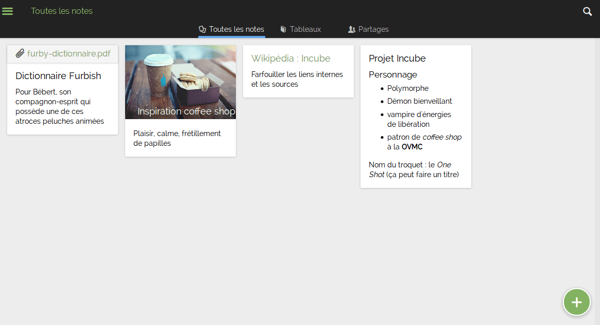

<!--
N.B.: This README was automatically generated by https://github.com/YunoHost/apps/tree/master/tools/readme_generator
It shall NOT be edited by hand.
-->

# Turtl for YunoHost

[](https://dash.yunohost.org/appci/app/turtl)  

[](https://install-app.yunohost.org/?app=turtl)

*[Lire ce readme en français.](./README_fr.md)*

> *This package allows you to install Turtl quickly and simply on a YunoHost server.
If you don't have YunoHost, please consult [the guide](https://yunohost.org/#/install) to learn how to install it.*

## Overview

Turtl is a free online service that allows you to create, synchronize and find your notes, in an encrypted manner. 

### Features

- Different note types: text, bookmark, password, image, and file/document
- Client-side cryptography to keep all of your data safe
- Securely share with anyone without compromising the security of your data
- Sharing allows different permissions ranging from read-only to full ownership of shared content
- Find your notes easily. Turtl supports full-text search, filtering by tag (or lack of tag), and sort by create/edit date
- Attach photos, files, and documents to your notes. Files are stored securely just like the rest of your data.
- Browser extension makes bookmarking easy on desktop
- Share to Turtl on Android for easy bookmarking and file uploads
- Write notes in Markdown, an easy and natural way to format text
- TeX math expressions in notes for math people (surround them by $$ to use)
- Multiple translations (German, Spanish, French, and more)
- RTL text support for our Farsi/Hebrew/etc-speaking friends
- Export/import your entire profile for backup purposes or to move between servers
- Semi-offline mode (you only need to be connected to log in)
- A number of keyboard shortcuts for navigation the app without mouse (type ? in-app to see shortcuts)
- An open-source server allows you to host your own Turtl data


**Shipped version:** 1.0~ynh3

## Screenshots



## :red_circle: Antifeatures

- **Package not maintained**: This YunoHost package is not maintained and needs adoption.

## Documentation and resources

* Official app website: <https://turtlapp.com>
* Official admin documentation: <https://turtlapp.com/docs/>
* Upstream app code repository: <https://github.com/turtl/server>
* YunoHost Store: <https://apps.yunohost.org/app/turtl>
* Report a bug: <https://github.com/YunoHost-Apps/turtl_ynh/issues>

## Developer info

Please send your pull request to the [testing branch](https://github.com/YunoHost-Apps/turtl_ynh/tree/testing).

To try the testing branch, please proceed like that.

``` bash
sudo yunohost app install https://github.com/YunoHost-Apps/turtl_ynh/tree/testing --debug
or
sudo yunohost app upgrade turtl -u https://github.com/YunoHost-Apps/turtl_ynh/tree/testing --debug
```

**More info regarding app packaging:** <https://yunohost.org/packaging_apps>