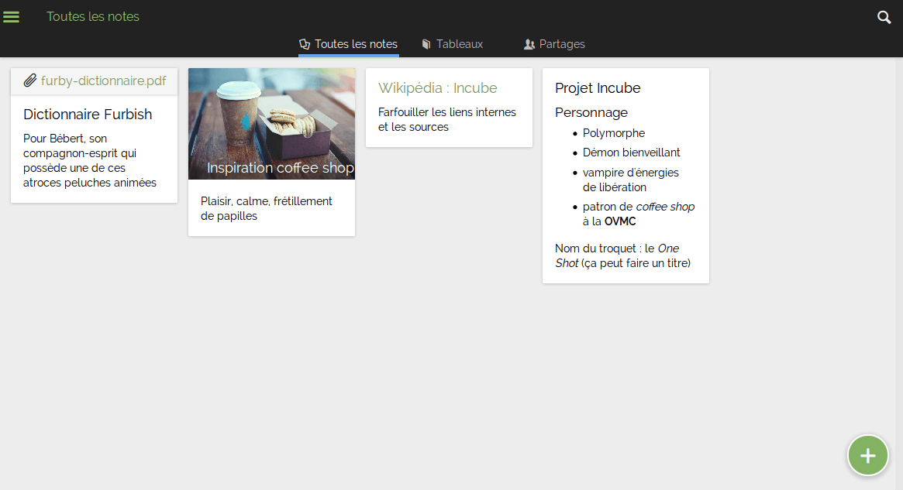

<!--
NOTA: Este README foi creado automáticamente por <https://github.com/YunoHost/apps/tree/master/tools/readme_generator>
NON debe editarse manualmente.
-->

# Turtl para YunoHost

[](https://dash.yunohost.org/appci/app/turtl)  

[](https://install-app.yunohost.org/?app=turtl)

*[Le este README en outros idiomas.](./ALL_README.md)*

> *Este paquete permíteche instalar Turtl de xeito rápido e doado nun servidor YunoHost.*  
> *Se non usas YunoHost, le a [documentación](https://yunohost.org/install) para saber como instalalo.*

## Vista xeral

Turtl is a free online service that allows you to create, synchronize and find your notes, in an encrypted manner. 

### Features

- Different note types: text, bookmark, password, image, and file/document
- Client-side cryptography to keep all of your data safe
- Securely share with anyone without compromising the security of your data
- Sharing allows different permissions ranging from read-only to full ownership of shared content
- Find your notes easily. Turtl supports full-text search, filtering by tag (or lack of tag), and sort by create/edit date
- Attach photos, files, and documents to your notes. Files are stored securely just like the rest of your data.
- Browser extension makes bookmarking easy on desktop
- Share to Turtl on Android for easy bookmarking and file uploads
- Write notes in Markdown, an easy and natural way to format text
- TeX math expressions in notes for math people (surround them by $$ to use)
- Multiple translations (German, Spanish, French, and more)
- RTL text support for our Farsi/Hebrew/etc-speaking friends
- Export/import your entire profile for backup purposes or to move between servers
- Semi-offline mode (you only need to be connected to log in)
- A number of keyboard shortcuts for navigation the app without mouse (type ? in-app to see shortcuts)
- An open-source server allows you to host your own Turtl data


**Versión proporcionada:** 2021.03.05~ynh1

## Capturas de pantalla



## :red_circle: Caraterísticas cuestionables

- **Package not maintained**: This YunoHost package is not maintained and needs adoption.

## Documentación e recursos

- Web oficial da app: <https://turtlapp.com>
- Documentación oficial para admin: <https://turtlapp.com/docs/>
- Repositorio de orixe do código: <https://github.com/turtl/server>
- Tenda YunoHost: <https://apps.yunohost.org/app/turtl>
- Informar dun problema: <https://github.com/YunoHost-Apps/turtl_ynh/issues>

## Info de desenvolvemento

Envía a túa colaboración á [rama `testing`](https://github.com/YunoHost-Apps/turtl_ynh/tree/testing).

Para probar a rama `testing`, procede deste xeito:

```bash
sudo yunohost app install https://github.com/YunoHost-Apps/turtl_ynh/tree/testing --debug
ou
sudo yunohost app upgrade turtl -u https://github.com/YunoHost-Apps/turtl_ynh/tree/testing --debug
```

**Máis info sobre o empaquetado da app:** <https://yunohost.org/packaging_apps>
